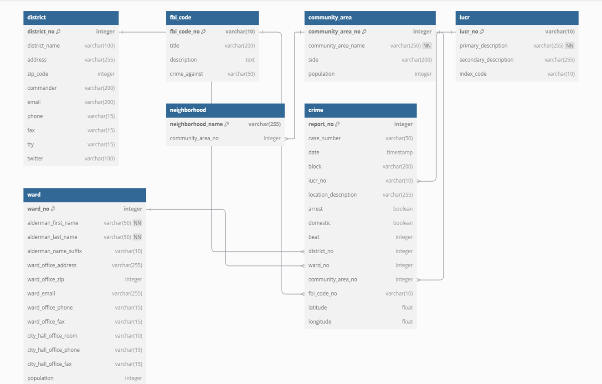

# Crime-Incident-Analysis-System: A-Comprehensive-Database-Framework-for-Chicago

## **Project Overview**
This project introduces a robust database framework for analyzing crime incidents in Chicago. The system addresses limitations of traditional recordkeeping methods by leveraging a relational database structure to ensure data integrity, scalability, and advanced analytical capabilities.

---

## **Key Features**
- Comprehensive database schema designed using an Entity-Relationship (E/R) model.
- Implementation with SQL, supporting complex queries and efficient data retrieval.
- Integration of real-world crime datasets from the Chicago Data Portal.
- Advanced querying capabilities for identifying crime trends, patterns, and correlations.
- Optimized query performance through indexing strategies.
- Web-based application for interactive data visualization and analysis.

---

## **Database Schema**
The database consists of the following main tables:
- **Crime**
- **District**
- **FBI Code**
- **Community Area**
- **IUCR** (Illinois Uniform Crime Reporting)
- **Ward**
- **Neighborhood**

Each table is normalized to **Boyce-Codd Normal Form (BCNF)** to ensure data integrity and minimize redundancy.

---

## **Data Source**
The primary dataset is sourced from the **Chicago Crimes Dataset**, available through the **City of Chicago's Open Data Portal**. It covers crime incidents from 2001 to the present.
https://data.cityofchicago.org/

---

## **Implemented Functionalities**
- Data loading and transformation processes.
- Complex SQL queries for crime analysis.
- Performance optimization through indexing.
- Web application for data visualization using **Streamlit**.

---

## **Technologies Used**
- **PostgreSQL**
- **Python**
- **SQLAlchemy**
- **Streamlit**

---

## **Installation and Setup**
1. **Database Setup**:  
   - Install PostgreSQL.  
   - Run `create.sql` to set up the database schema.  
   - Use `load.sql` to load data into the database.
  
---

### Streamlit Framework
- User-friendly interface built with Streamlit.
- Database connection established through SQLAlchemy for seamless interaction.  

---

## **Usage**
1. Use SQL tools or the web application to query and analyze crime data.  
2. Generate insights, identify trends, and visualize data interactively through the web interface.  

